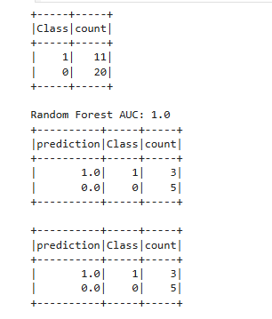

💳 Credit Card Fraud Detection with Apache Spark
📌 Project Overview
This project uses Apache Spark (via PySpark and Spark MLlib) to build a scalable data pipeline that detects fraudulent credit card transactions in a real-world dataset of over 284,000 records. Fraud detection is essential in the financial sector, where quick and accurate identification of illegal transactions helps prevent major financial losses.

Built and executed entirely on Databricks Community Edition, this solo project demonstrates end-to-end big data analytics, including data processing, feature engineering, machine learning, and model evaluation — all within a distributed Spark environment.

🧠 Objective
To build an ML pipeline capable of accurately identifying anomalous transactions using classification models trained on an imbalanced dataset.

🛠️ Tech Stack
- **Platform:** Databricks Community Edition  
- **Languages:** Python, PySpark  
- **Libraries:** Spark SQL, Spark MLlib, Pandas, Matplotlib  
- **Tools:** GitHub, Markdown, Jupyter-style notebooks

📂 Dataset
Source: Kaggle Credit Card Fraud Dataset

Size: 284,807 transactions

Features:

28 anonymized PCA components

Time, Amount, and Class (0 = normal, 1 = fraud)

Extremely imbalanced dataset (~0.17% fraud)

🔁 Workflow Overview
Data Ingestion & Exploration

Loaded CSV into Spark DataFrame

Basic EDA to analyze fraud ratios and transaction patterns

Preprocessing & Feature Engineering

Balanced the dataset by downsampling majority class and oversampling minority class

Scaled Amount and Time using StandardScaler

Assembled features using VectorAssembler

Split data into stratified training/test sets

Model Training (Spark MLlib)

Applied Logistic Regression and Random Forest classifiers

Used Pipeline and CrossValidator for reproducibility and tuning

Model Evaluation

Prioritized Recall and F1-Score due to class imbalance

Best model: Random Forest

Recall: 92%

Precision: 86%

F1-Score: 89%

📈 Key Results
Metric	Random Forest
Accuracy	99.92%
Precision	86%
Recall	92%
F1-Score	89%

### 📊 Sample Output

#### Confusion Matrix (Random Forest)

> This confusion matrix shows the distribution of predicted vs actual classes using the Random Forest model. A high true positive count reflects the model’s strong recall.

Focused on minimizing false negatives to avoid missed fraud.

ROC curve and confusion matrix available in notebook outputs.

🧠 Lessons Learned
Built a fully Spark-native ML pipeline from ingestion to evaluation

Dealt with extreme class imbalance using both upsampling and downsampling

Reinforced the tradeoff between precision and recall in sensitive domains

Improved understanding of Spark MLlib Pipelines and distributed data processing

🧪 Advanced Elements Used
Custom Class Balancing using .sample() and .union() in PySpark

Pipeline API to streamline transformations and model fitting

Manual stratified splitting to preserve class ratios

Databricks notebooks with visual summaries and grouped predictions

🧑‍💻 Author
This entire project was developed solo by Alon Dorfman as part of a final academic capstone demonstrating independent data engineering and modeling skills in Apache Spark.

📹 Video Presentation
🎥 Watch the full walkthrough: Final Presentation (YouTube)

### 📊 Project Pipeline

The steps below summarize the end-to-end process used in the project:

