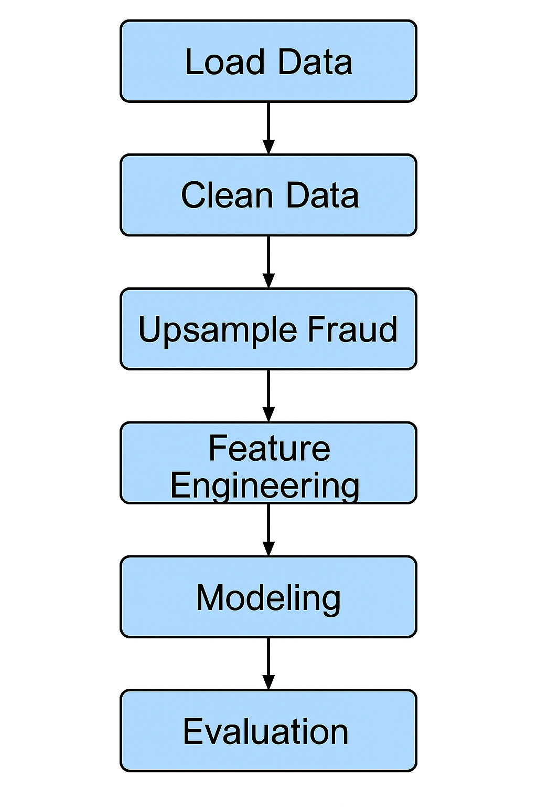

# Credit Card Fraud Detection (Spark Project)

This project uses PySpark and SparkML to find illegal credit card operations in the Databricks Community Edition.

## 🔧 Technologies
- Databricks Community Edition
- PySpark
- SparkSQL
- SparkML (Random Forest)

## 📁 Dataset
A public dataset containing anonymized transaction data, available [on Kaggle](https://www.kaggle.com/datasets/mlg-ulb/creditcardfraud).  
Features are transformed via PCA and include a `Class` column (1 = fraud, 0 = non-fraud).

## 📊 Project Flow

1. **Data Loading & Cleaning**   
- Use schema inference to read a CSV file 
- The label column was cast with integer 
- To get rid of any nulls

2. **Class Balancing**
   - Decrease the number of non-fraud transactions to balance with fraud transactions
   - Increase fraud cases in order to balance the dataset (using replacement)
   - Aggregate and stratify the split in the training and the testing set

3. **Feature Engineering**
   - You can use VectorAssembler to construct the features column

4. **Modeling**
- Fit the data using RandomForestClassifier 
- Compute AUC (BinaryClassificationEvaluator)   
- Print the distribution of the predictions and the actual breakdown

## 📈 Result
Achieved **AUC = 1.0** due to clean balancing and fraud separation.

## 📹 Video Presentation
View the entire 10-minute guide <!-- Replace this after upload --> ">☛YouTube Link

## 👤 Author
Alon Dorfman — the only person who developed the final group project

✔️ Advanced SparkML Feature Used
Executed RandomForestClassifier with self-made class overbalancing to increase the importance of the less frequent class.
Split the data into training and testing datasets which were representative of both fraud and non-fraud classes.

✔️ Advanced Visualization
Output of the model and relevant prediction summaries were provided in Databricks which were also generated using Spark (.groupBy().count() )
The results of the AUC evaluation and the summaries of class distribution were reflected in Databricks themselves.

✔️ Novel Problem Solving
A combination of methods was employed for solving the issue of class imbalance, which includes:
 Randomly picking the majority class (Class = 0) in the example dataset by executing .sample()
 Repeating the minority class (Class = 1) with withReplacement=True
Manually doing the stratified division of the dataset into training and testing sets

✔️ Spark-only Implementation
Overall project was completed exclusively by the use of PySpark, SparkSQL, and SparkML within the Databricks Community Edition.
There was no usage of the pandas library or other supplementary tools.

### 📊 Project Pipeline

The steps below summarize the end-to-end process used in the project:

